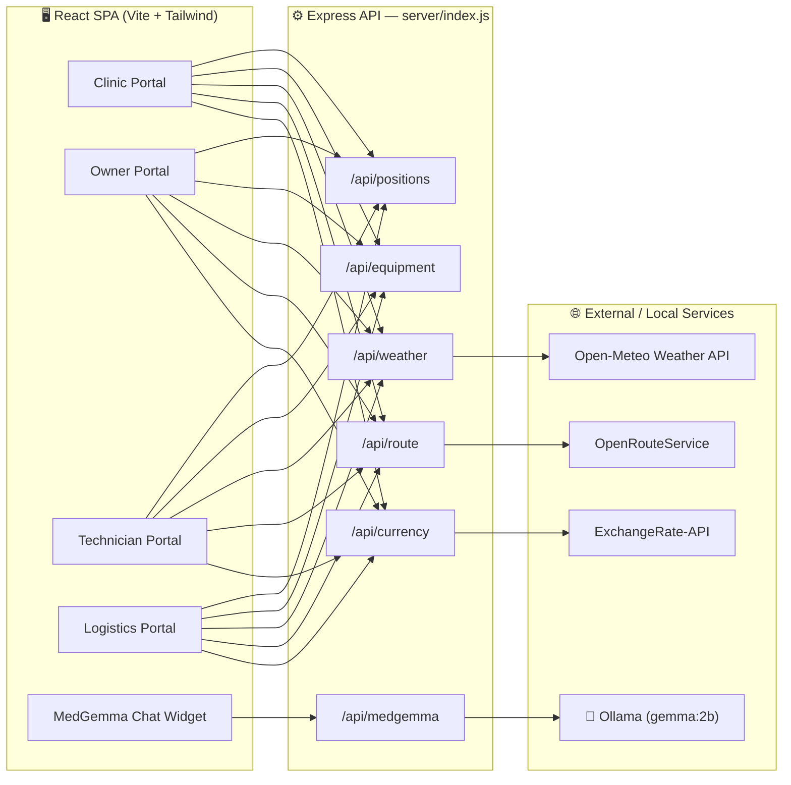

# 🏥 ResourceRX

**A peer-to-peer medical equipment sharing platform** — connecting hospitals with idle high-value equipment (MRI, CT, Dialysis, Ventilators & more) to clinics that need them, on demand.

<p align="center">
  
  
  
  
  
  
</p>

<p align="center">
  <b>4 Portals · 35+ Routes · Live AI Assistant · Zero Cloud Dependency</b><br/>
  <sub>Built by <a href="https://github.com/DharmiSapariya">Dharmi Sapariya</a> & Jasmine</sub>
</p>

---

## 📖 Table of Contents

- [What is ResourceRX?](#-what-is-resourcerx)
- [Portals & Features](#-portals--features)
- [Architecture](#-architecture)
- [Tech Stack](#-tech-stack)
- [Getting Started](#-getting-started)
- [Running the App](#-running-the-app)
- [Project Structure](#-project-structure)
- [API Reference](#-api-reference)
- [Routes Map](#-routes-map)
- [Roadmap](#-roadmap)
- [Contributing](#-contributing)
- [Authors](#-authors)

---

## 🚀 What is ResourceRX?

Hospitals sit on millions of dollars of equipment that's idle most of the day, while clinics down the street can't afford their own MRI or dialysis unit. **ResourceRX** is the marketplace that fixes that mismatch — think "Airbnb for medical equipment," with real-time logistics tracking, live weather/route-aware ETAs, and an on-device AI assistant that never sends patient data to the cloud.

> 💡 Every AI feature runs **locally via Ollama** — no OpenAI key, no data leaving your machine, no recurring API bill.

## 🧩 Portals & Features

ResourceRX ships with four dedicated, role-based portals — each with its own sidebar, dashboard, and workflows.

<table>
<tr>
<td width="25%" valign="top">

### 🩺 Clinic
The equipment renter's experience.

- 🔍 Search live equipment inventory by type
- 📅 Book → pay → track → complete, end-to-end
- 🚨 One-tap emergency requests
- 💳 Built-in payment & invoicing flow
- ⭐ Post-session feedback loop
- 📝 Self-serve clinic registration

</td>
<td width="25%" valign="top">

### 🏢 Owner
The equipment lender's cockpit.

- ➕ List new equipment for sharing
- 📊 Yield & utilization analytics
- 🚚 Dispatch approvals
- 📥 Incoming request management
- 🏦 Settlements & payouts
- 🔐 Asset vault & compliance docs

</td>
<td width="25%" valign="top">

### 🔧 Technician
Keeps the hardware alive.

- 🛠️ Service order queue
- 📈 Calibration logging
- 🩻 Diagnostics console
- 📦 Tactical inventory tracking
- 🚀 Deployment prep checklists
- ⚠️ Incident reporting
- 📚 Technical library

</td>
<td width="25%" valign="top">

### 🚛 Logistics
Moves equipment safely, on time.

- 🗺️ Live map with real-time unit positions
- 🌦️ Weather-aware ETA adjustments
- 🛣️ Real driving-route calculation
- 📋 Active shipment tracking
- 🧾 Trip logs & audit trail
- ⚙️ Fleet & ops settings

</td>
</tr>
</table>

### 🤖 On-Device AI Assistant

A floating **MedGemma** chat widget (powered by `gemma:2b` via Ollama) is embedded across the Clinic, Owner, Technician and Logistics portals — helping with equipment questions, diagnostics guidance, incident triage, and more, entirely offline.

## 🏗️ Architecture



## 🛠️ Tech Stack

| Layer | Technology |
|---|---|
| **Frontend** | React 19, React Router 7, Vite (Rolldown), Tailwind CSS 3, Framer Motion, Lucide Icons |
| **Backend** | Node.js, Express 5, node-fetch, CORS |
| **AI Engine** | Ollama running `gemma:2b` (fully local inference) |
| **Live Data** | Open-Meteo (weather), OpenRouteService (routing), ExchangeRate-API (currency) |
| **State** | React Context (`ClinicContext`) + custom hooks (`useRealData`) |
| **Tooling** | ESLint 9, PostCSS, Autoprefixer |

## ⚡ Getting Started

### Prerequisites

| Requirement | Notes |
|---|---|
| **Node.js 18+** | Required for the Vite frontend and Express backend |
| **npm** | Ships with Node.js |
| **Ollama** | [Download here](https://ollama.com) — ~2 GB disk |
| **gemma:2b model** | Pulled via Ollama — ~1.5 GB download |
| **Git** | For cloning and collaboration |

### Installation

```bash
# 1. Clone the repo
git clone https://github.com/DharmiSapariya/ResourceRX.git
cd ResourceRX

# 2. Install frontend dependencies
npm install

# 3. Install backend dependencies
cd server && npm install && cd ..

# 4. Install Ollama (macOS / Linux)
curl -fsSL https://ollama.com/install.sh | sh
# Windows: download the installer from https://ollama.com

# 5. Pull the AI model (one-time, ~1.5 GB)
ollama pull gemma:2b
```

## ▶️ Running the App

You'll need **three terminals** running side by side:

```bash
# Terminal 1 — AI engine
ollama serve

# Terminal 2 — Express AI proxy + live-data backend
cd server && node index.js

# Terminal 3 — React frontend
npm run dev
```

| Service | URL |
|---|---|
| 🖥️ Frontend app | http://localhost:5173 |
| ⚙️ Backend API | http://localhost:5000 |
| ✅ AI health check | `curl http://localhost:5000/test-ai` |

## 📁 Project Structure

```
ResourceRX/
├── server/                  # Express backend (AI proxy + live data APIs)
│   └── index.js
├── src/
│   ├── components/          # Shared UI — sidebars, MedGemmaChat widget
│   ├── context/              # ClinicContext (global booking/asset state)
│   ├── hooks/                # useRealData — equipment, weather, routes, currency
│   ├── pages/
│   │   ├── Clinic/            # 9 pages — search, booking, payment, tracking...
│   │   ├── Owner/              # 8 pages — add, analytics, dispatch, vault...
│   │   ├── Technician/         # 8 pages — diagnostics, calibration, incidents...
│   │   └── Logistics/          # 6 pages — dashboard, map, active, settings...
│   ├── App.jsx                # Routes + layout shell
│   └── main.jsx
└── package.json
```

## 🔌 API Reference

All endpoints are served from the Express backend at `http://localhost:5000`.

| Method | Endpoint | Description |
|---|---|---|
| `GET` | `/api/positions` | Real-time fleet unit positions (polled every 5s) |
| `GET` | `/api/equipment?type=MRI` | Equipment inventory by type |
| `GET` | `/api/weather?lat=&lng=` | Live weather + ETA impact via Open-Meteo |
| `GET` | `/api/route?startLat=&startLng=&endLat=&endLng=` | Real driving route via OpenRouteService |
| `GET` | `/api/currency?base=USD` | Live currency conversion rates |
| `POST` | `/api/medgemma` | Local AI chat proxy (Ollama → `gemma:2b`) |
| `GET` | `/test-ai` | Quick AI health check |

## 🗺️ Routes Map

<details>
<summary>Click to expand full route list (35 routes)</summary>

| Portal | Routes |
|---|---|
| **Public** | `/`, `/login` |
| **Clinic** | `/clinic`, `/clinic/dashboard`, `/clinic/search`, `/clinic/booking`, `/clinic/tracking`, `/clinic/payment`, `/clinic/completion`, `/clinic/emergency`, `/clinic/feedback`, `/clinic/register` |
| **Owner** | `/owner`, `/owner/dashboard`, `/owner/add`, `/owner/analytics`, `/owner/dispatch`, `/owner/requests`, `/owner/settlements`, `/owner/vault`, `/owner/yield` |
| **Technician** | `/tech/dashboard`, `/tech/service-orders`, `/tech/calibration`, `/tech/diagnostics`, `/tech/incidents`, `/tech/inventory`, `/tech/library`, `/tech/prep` |
| **Logistics** | `/logistics`, `/logistics/dashboard`, `/logistics/active`, `/logistics/incident`, `/logistics/logs`, `/logistics/map`, `/logistics/settings` |

</details>

## 🧭 Roadmap

- [ ] Persist bookings & inventory to a real database
- [ ] Auth & role-based access control
- [ ] Push notifications for dispatch/incident events
- [ ] Multi-model AI support (swap `gemma:2b` for larger local models)
- [ ] Mobile-responsive logistics map

## 🤝 Contributing

Contributions, issues and feature requests are welcome!

1. Fork the project
2. Create your feature branch (`git checkout -b feature/amazing-feature`)
3. Commit your changes (`git commit -m 'Add some amazing feature'`)
4. Push to the branch (`git push origin feature/amazing-feature`)
5. Open a Pull Request

## 👥 Authors

Built with ❤️ by:

- **Dharmi Sapariya** — [@DharmiSapariya](https://github.com/DharmiSapariya)
- **Jasmine**

---

<p align="center">⭐ If you find ResourceRX useful, consider starring the repo!</p>
